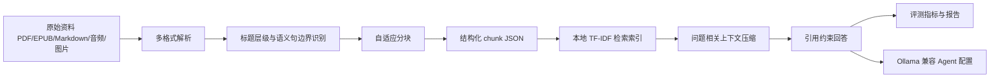

# 架构设计与数据流

## 目标

本项目实现一套端到端的自动化知识蒸馏与智能体生成管线。这里的“蒸馏”指知识结构化提取与轻量封装，不涉及模型权重蒸馏。当前交付按用户要求先完成计算机单学科闭环。

## 数据流

## 核心模块

- `kd_agent/ingestion.py`：解析 Markdown/TXT/JSONL/PDF/EPUB，并为图片、音频保留本地 OCR/ASR 接入点。
- `kd_agent/chunking.py`：按标题层级、句边界和 token 预算进行自适应分块。
- `kd_agent/indexing.py`：构建轻量 TF-IDF 索引，支持无网络、无 GPU 环境运行。
- `kd_agent/agent.py`：执行 Top-K 检索、上下文压缩、引用锚点生成和无依据拒答。
- `kd_agent/evaluation.py`：计算 Hit@5、答案关键词命中率、无引用生成率、延迟和 token 消耗。
- `kd_agent/reporting.py`：生成 Markdown 评估报告。

## 优化点

1. 自适应分块保留章节语义，避免 baseline 固定长度切分破坏证据边界。
2. 上下文压缩只保留与问题相关的证据句，降低输入 token。
3. Citation Grounding 强制答案引用来源，降低无依据生成。
4. 本地轻量索引不依赖云 API，能在无 GPU 环境下完成评测闭环。
5. Ollama Modelfile 与 agent config 分离，便于后续替换 Q4/Q5 GGUF 权重。

## 当前边界

- 当前数据集是计算机单学科小型可复现样例，不是最终三学科 ≥100 页正式数据集。
- 图片和音频已进入接口设计，但当前仅登记占位；正式版可接入 PaddleOCR/Tesseract 与 whisper.cpp/faster-whisper。
- 当前回答器为引用约束抽取式实现；接入 Ollama 后可替换为生成式回答，但应保留检索、压缩和引用守卫。
